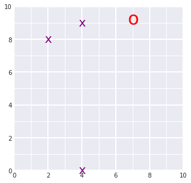

# Landmark Detection and Tracking (SLAM)
----- SLAM (Simultaneous Localization and Mapping) for a 2 dimensional world -----
I'm currently trying to expand this work for 3 dimensional worlds. Do get in touch if you want to contribute!
## Overview
Combining knowledge of robot sensor measurements and movement to create a map of an environment from only sensor and motion data gathered by a robot, over time. SLAM provides a way to track the location of a robot in the world in real-time and identify the locations of landmarks such as buildings, trees, rocks, and other world features.
<br/>
Below is an example of a 2D robot world with landmarks (purple x's) and the robot (a red 'o') located and found using only sensor and motion data collected by that robot. 
<br/>

<br/>
## Files
```moving_and_sensing.ipynb``` : Define and visualize the world (environment) <br/>
```Omega_and_Xi``` : Constraints and solving (linear algebra) <br/>
```Landmark_Detection_and_Tracking``` : SLAM implementation <br/>
```robot_class.py``` : Robot class definition <br/>
<br/>
## Key concepts to accommodate or use: <br/>
### Uncertainty <br/>
Robot motion and sensors have some uncertainty associated with them. For example, imagine a car driving up hill and down hill; the speedometer reading will likely overestimate the speed of the car going up hill and underestimate the speed of the car going down hill because it cannot perfectly account for gravity. Similarly, we cannot perfectly predict the motion of a robot. A robot is likely to slightly overshoot or undershoot a target location. <br/>
To perform SLAM, we'll collect a series of robot sensor measurements and motions (with some noise; accounting for uncertainty), in that order, over a defined period of time. Then we'll use only this data to re-construct the map of the world with the robot and landmark locations. 

### Omega, Xi and constraints <br/>
Matrix representation of Omega and Xi respectively: <br/>
 <br/>
<br/>
Poses as constraints filled in the matrix (example): <br/>
 <br/>
<br/>
See notebook: ```Omega_and_Xi``` for a detailed explanation. <br/>

## Instructions to run
1. Type ```git clone https://github.com/siddsrivastava/SLAM-Landmark-Detection-and-Tracking.git``` in your Git bash (Terminal)
2. Open terminal and type: ```jupyter notebook``` (make sure you've already installed jupyter notebook)
3. Navigate to the 'SLAM-Landmark-Detection-and-Tracking' folder and browse through the notebooks/files.
